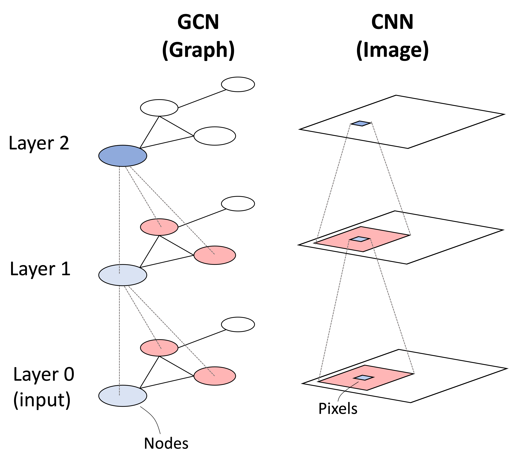

# Graph-Convolutions-and-NGD-Optimization

This reposityory is meant to start with an introduction to graphs convolutions, motivating some of the ideas from the modern perspective of symmetries and representations. Afterwards, an example of an optimization to the classic GCN architecture, where in addition to the usual step in changing the weights by the gradient of the loss with respect to them, there is an additional matrix preconditioner that combines those gradients. This last idea will follow the original paper ["Optimization of Graph Neural Networks with Natural Gradient Descent"](https://arxiv.org/pdf/2008.09624). 

## Introduction to GCN by a parallel with symmetries in CNN's

I will use a connection between how you could derive the convolution of a graph with its counterpart the convolution of an image or a 3D (channels included) image.

<p align="center">

</p>

In ["Symmetry CNN Notes"](https://github.com/AndreiB137/Graph-Convolutions-and-NGD-Optimization/blob/main/Symmetry%20CNN%20Notes.pdf) we can see how by exploiting particular symmetries that our architecture should posses under data transformations, we are able to derive the exact form of the convolution. The symmetries are justified. In the example of classification, a picture of a tree rotated or transleted by some amount to the right should still be classified as a tree. For the neural network to not distinguish between the original tree image and its rotation, the activations in the next layers of the convolution operation should be affected by the same rotation. In other words, the feature maps are also rotated. In this manner, the neural network uses esentially the same activations from the original image in classifying. The idea can be generalized to general finite or infinite dimensional group representations, and gauge groups (or coordinate changes). The later is appropriate if we consider the data distribution as living on a manfiold and we are looking for invariant characteristics at the intersection of two neighborhoods with different gauge groups (or coordinate transformations). Since this is not my main point to show in this repository, you can read more about it in the following book by [Maurice Weiler, Patric Forré, Erik Verlinde Max Welling](https://maurice-weiler.gitlab.io/cnn_book/EquivariantAndCoordinateIndependentCNNs.pdf).


<p align = "center">



</p>

We have seen the example of an image convolution, how should we construct a convolution operator in the context of a graph structured data? What symmetries should our graph data have? The two questions are very connected, if we can manufacture an operator that we specially call a convolution (it might not be familliar to the integral convolution or finite convolution in the case before), then we can find its symmetries. From the other perspective, knowing the symmetries of our graph it will give us clues to what operators to consider. Indeed, the operators should be compatible with the graph structure, so we can't think of all the operators that satisfy the symmetries, but a subset of them. # Say about another file in the repository with the continuation of the discussion from ipad notes

## NGD Optimization

After we digested those various ideas, we turn to the NGD optimization. The paper shows an empirical accuracy advantage compared to using merely Adam or SGD with the gradient weights unmodified. In the case of SGD, it can be seen a substantial improvement with a triple or even more test accuracy in the same number of epochs trained. In Adam, the gradient step is optimized using adaptive momentum (or information from the previous updates) which helps for convergence efficiency, while SGD uses only the last update. We can see how SGD with a change in gradients provided by NGD is able to equal the performence of Adam with no NGD (in the same number of epochs) suggesting the importance of using a preconditioner, especilly in the context of Graph Convolutional Networks. 

# Mathematical details

I have been naming preconditioner for a couple of times, but we are going to look at it now. # Point out to some notes again

## A few comments on implementation

<p align = "center">


</p>

Turning to implementation. At the time of writting, I can't match the performance obtained by the paper (I also get contrary results) authors with my own code. Also, all my tests have been done on the small Cora dataset. I am still debugging and fixing things. For Adam, I can obtain most of the test accuracy statistics on Cora, but for SGD I am getting worse performance compared with the non-optimized version. As can be seen as a difference between the first and second plots above, the performance of the Adam model reaches its best for low values of epsilon, while the SGD for high values. This is in contrast with the faster convergence with both optimizers for low epsilon values. In third picture you can see how the accuracy of the model on the whole dataset increases or decreases depending on epsilon.

## Acknowledgements

I want to give credits and appreciation to [Aleksa Gordić](https://github.com/gordicaleksa) for using a similar repository style as him.

## Citation

If you find this repository useful, please cite the following:

```
@misc{Bodnar2024GCN-NGD,
  author = {Bodnar, Andrei},
  title = {Graph-Convolutions-and-NGD-Optimization},
  year = {2024},
  publisher = {GitHub},
  journal = {GitHub repository},
  howpublished = {\url{[https://github.com/gordicaleksa/pytorch-GAT](https://github.com/AndreiB137/Graph-Convolutions-and-NGD-Optimization)}},
}
```

## Licence

[](LICENSE)
